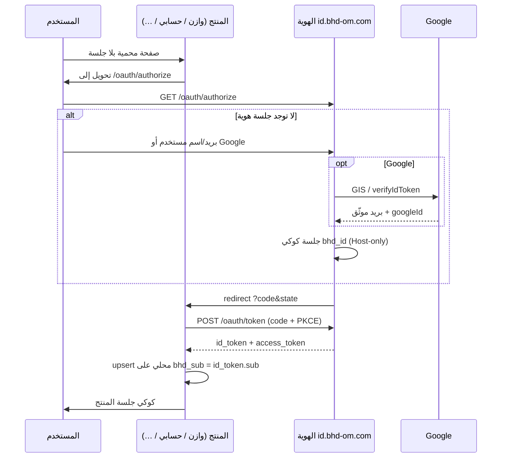

# مواصفة هوية BHD الموحّدة (BHD Identity / SSO)

> **الحالة:** معتمدة للتنفيذ كما هي — لا تُحرَّف محلياً في كل مستودع.  
> **المصدر الوحيد:** هذا الملف في [ainoamn/ONE-BHD](https://github.com/ainoamn/ONE-BHD) — `docs/BHD-IDENTITY-SSO.md`  
> **التاريخ:** 18 أغسطس 2026  
> **الإصدار:** `bhd-identity.v1`  
> **الناشر:** بوابة BHD — مشروع Vercel `one-bhd`  
> **المُصدِر (Issuer):** `https://id.bhd-om.com`  
> **الدليل التشغيلي للفرق:** [`BHD-UNIFIED-LOGIN-AND-APPS.md`](BHD-UNIFIED-LOGIN-AND-APPS.md) — كيف يُبنى الدخول، كيف يعمل التنقل دون إعادة تسجيل، وكيف يوثّق كل موقع تثبيته وتقنياته.

**حالة التنفيذ الحي (18 أغسطس 2026):** مزوّد الهوية يعمل على البوابة المنشورة. اكتشاف OIDC:
`https://one-bhd.vercel.app/.well-known/openid-configuration`
وشاشة الدخول: `https://one-bhd.vercel.app/login`.
بعد CNAME لـ `id` → `cname.vercel-dns.com` يُضبط `BHD_IDENTITY_ISSUER=https://id.bhd-om.com`.
دخول البريد يحتاج `DATABASE_URL` و`AUTH_SECRET` على مشروع Vercel `one-bhd`.

انسخ هذا الملف إلى مستودع المنتج تحت `docs/BHD-IDENTITY-SSO.md` دون تعديل القيم المجمّدة. نفّذ قسم «عقد التنفيذ» ثم قسم منتجك فقط.

---

## 0. عقد التنفيذ (للوكيل والمطوّر)

1. **لا تشارك** `DATABASE_URL` بين وازن وحسابي والبوابة وأي منتج آخر.
2. **لا تنسخ** كلمات المرور ولا كوكي الجلسة بين المنتجات.
3. **لا تضع** زر Google على واجهة المنتج بعد ربط OIDC. جوجل يحدث فقط على نطاق الهوية.
4. **لا تمنح** أدوار مدير عبر الهوية. الأدوار محلية لكل منتج بعد التعرف على `sub`.
5. المعرّف المشترك الوحيد هو مطالبة JWT: **`sub`** = UUID المستخدم في جداول الهوية (`bhd_users.id`).
6. كل منتج يخزّن `bhd_sub` (نفس قيمة `sub`) ويربط حسابه المحلي به.
7. بروتوكول الربط: **OAuth 2.0 Authorization Code + PKCE (S256)** مع **OpenID Connect**.
9. مشغّل التطبيقات بعد الدخول مواصفته [`BHD-APP-SWITCHER.md`](BHD-APP-SWITCHER.md). لا تُبتكر قائمة تطبيقات محلية.

---

## 1. الهدف

حساب BHD واحد: بريد أو اسم مستخدم أو Google. المستخدم يدخل مرة على `id.bhd-om.com`، ثم كل مواقع المجموعة تتعرّف عليه بنفس البيانات الشخصية (الاسم، البريد، الهاتف، دفتر العناوين). بيانات العمل (محافظ، فواتير، شجرات، طلبات) تبقى في قاعدة ذلك المنتج.



---

## 2. قيم مجمّدة — لا تغيّرها

| المفتاح | القيمة |
|---|---|
| مواصفة البروتوكول | `bhd-identity.v1` |
| Issuer | `https://id.bhd-om.com` |
| نطاق الهوية في DNS | `id` CNAME → `cname.vercel-dns.com` (ليس `vercel-dns-017`) |
| مشروع Vercel للهوية (المرحلة 1–2) | `one-bhd` |
| مستودع الهوية | `ainoamn/ONE-BHD` — مجلد النشر `BHD-Complete-Brand-and-Portal-v1.1.0` |
| مشروع Neon للهوية | `bhd-identity` (منظمة Neon الحالية) |
| خوارزمية كلمة المرور في الهوية | `bcryptjs` rounds `12` |
| خوارزمية ID Token | `RS256` عبر JWKS. مؤقتاً حتى تُولَّد المفاتيح: `HS256` بمفتاح `IDENTITY_TOKEN_SECRET` **لكل عميل audience** يُرفض إن لم يُتحقق `iss` و`aud` |
| صلاحية كود التفويض | 60 ثانية، استخدام واحد |
| صلاحية ID Token | 10 دقائق |
| صلاحية Access Token | 10 دقائق |
| صلاحية Refresh Token | 30 يوماً، تدوير عند كل استخدام |
| صلاحية جلسة الهوية `bhd_id` | 48 ساعة **خمول منزلق**: أي استخدام يجدّد؛ بعد 48 ساعة بلا استخدام يُسجَّل الخروج تلقائياً |
| PKCE | إلزامي، `S256` فقط |
| scopes الافتراضية | `openid profile email` |
| مطالبات ID Token الإلزامية | `iss`, `aud`, `sub`, `exp`, `iat`, `nonce`, `email`, `email_verified` |
| مطالبات اختيارية | `name`, `picture`, `preferred_username`, `phone_number` |

### 2.1 معرّفات العملاء (client_id)

هذه النصوص ثابتة في كل المستودعات:

| المنتج | `client_id` | نطاق الإنتاج | `redirect_uri` الإنتاج |
|---|---|---|---|
| البوابة | `bhd-portal` | `https://www.bhd-om.com` و`https://bhd-om.com` | `https://www.bhd-om.com/api/auth/bhd/callback` |
| وازن | `bhd-wazen` | `https://wazen.bhd-om.com` | `https://wazen.bhd-om.com/api/auth/bhd/callback` |
| حسابي | `bhd-hisaby` | `https://hisaby.bhd-om.com` (و`hisaby.pro`) | `https://hisaby.bhd-om.com/api/auth/bhd/callback` |
| نَسَب | `bhd-nasab` | `https://nasab.bhd-om.com` | `https://nasab.bhd-om.com/api/auth/bhd/callback` |
| متجر BHD | `bhd-store` | `https://bhdstor.bhd-om.com` | `https://bhdstor.bhd-om.com/api/auth/bhd/callback` |
| مكتب BHD | `bhd-office` | `https://baitak.bhd-om.com` | `https://baitak.bhd-om.com/api/auth/bhd/callback` |
| بيتك | `bhd-baitak` | `https://baitak.bhd-om.com` | `https://baitak.bhd-om.com/api/auth/bhd/callback` |

محلياً لكل منتج:

- `http://localhost:3000/api/auth/bhd/callback`
- حسابي إن فصل الواجهة/الـ API: `http://localhost:3000/api/auth/bhd/callback` (الواجهة) ويجب أن يمر عبر نفس المنشأ حتى تُضبط الكوكي.

`redirect_uri` يُقارَن **مطابقة تامة** (لا بادئة مرنة).

### 2.2 أسرار البيئة

**على مشروع الهوية (`one-bhd` / لاحقاً مشروع `bhd-identity`):**

| المتغير | الغرض |
|---|---|
| `DATABASE_URL` | Neon `bhd-identity` (pooled على Vercel) |
| `AUTH_SECRET` | توقيع كوكي جلسة الهوية `bhd_id` |
| `IDENTITY_TOKEN_SECRET` | احتياطي HS256 إن لم تُفعَّل JWKS بعد |
| `BHD_IDENTITY_ISSUER` | `https://id.bhd-om.com` |
| `GOOGLE_CLIENT_ID` | نفس عميل One BHD |
| `NEXT_PUBLIC_GOOGLE_CLIENT_ID` | نفس القيمة |
| `FACEBOOK_APP_ID` | تطبيق Meta `bhd-om.com` (`2020952291888711`) |
| `FACEBOOK_APP_SECRET` | سر التطبيق في Vercel فقط |
| `BHD_OAUTH_CLIENTS` | JSON للعملاء (انظر 2.3) أو جدول `bhd_oauth_clients` |
| `BHD_PLATFORM_ADMIN_EMAILS` | بريد مديري المنصة، مفصول بفاصلة. يفتح `/admin` |

**لوحة التحكم:** `https://id.bhd-om.com/admin` و`https://www.bhd-om.com/admin` نفس التطبيق. الدخول بحساب هوية موجود في القائمة. لا تُفهرس. أدوار المنتجات لا تُمنح من هنا.

**على كل منتج:**

| المتغير | الغرض |
|---|---|
| `BHD_IDENTITY_ISSUER` | `https://id.bhd-om.com` |
| `BHD_OAUTH_CLIENT_ID` | من جدول 2.1 |
| `BHD_OAUTH_CLIENT_SECRET` | سر العميل (خادم فقط) |
| `BHD_OAUTH_REDIRECT_URI` | القيمة المسجّلة مطابقة تامة |
| `AUTH_SECRET` أو سر الجلسة الحالي للمنتج | يبقى **مختلفاً** عن هوية BHD؛ يوقّع كوكي المنتج فقط |

لا ترفع الأسرار إلى Git.

### 2.3 مثال تسجيل عميل

```json
{
  "client_id": "bhd-wazen",
  "client_secret_hash": "<bcrypt للسر>",
  "redirect_uris": [
    "https://wazen.bhd-om.com/api/auth/bhd/callback",
    "http://localhost:3000/api/auth/bhd/callback"
  ],
  "scopes": ["openid", "profile", "email"],
  "first_party": true,
  "token_endpoint_auth_method": "client_secret_post"
}
```

العملاء من الطرف الأول (`first_party: true`) يتجاوزون شاشة الموافقة بعد أول دخول ناجح لنفس `client_id`+`sub`.

---

## 3. ماذا يُحفظ أين

| الطبقة | الجداول / البيانات | من يقرأ |
|---|---|---|
| الهوية | `bhd_users`, `bhd_contacts`, `bhd_oauth_clients`, `bhd_oauth_codes`, `bhd_oauth_refresh`, `bhd_oauth_consents` | خدمة `id.bhd-om.com` فقط |
| وازن | المحافظ، الأعضاء، الفوترة + عمود `bhd_sub` | وازن فقط |
| حسابي | الشركات، الفواتير، الكاشير + عمود `bhd_sub` على المستخدم | حسابي فقط |
| البوابة | بعد المرحلة 2 تصبح واجهة فوق الهوية أو تحوّل `/login` إلى المُصدِر | لا قاعدة مستخدمين ثانية |
| نَسَب / متجر / مكتب / بيتك | بيانات المنتج + `bhd_sub` | ذلك المنتج فقط |

`bhd_contacts` من نوع `SELF` هو دفتر عناوين الحساب الموحّد. دفاتر عملاء حسابي تبقى جداول حسابي.

---

## 4. نقاط نهاية الهوية (يلتزم بها كل عميل)

قاعدة: `https://id.bhd-om.com`

| الطريقة | المسار | الوظيفة |
|---|---|---|
| GET | `/.well-known/openid-configuration` | اكتشاف OIDC |
| GET | `/oauth/jwks.json` | مفاتيح RS256 |
| GET | `/oauth/authorize` | بدء الدخول (يحتاج جلسة هوية أو يعرض `/login`) |
| POST | `/oauth/token` | استبدال `code` أو `refresh_token` |
| GET | `/oauth/userinfo` | Bearer access token |
| POST | `/oauth/revoke` | إلغاء refresh |
| GET | `/oauth/end-session` | خروج موحّد (RP-initiated logout) |
| GET | `/login` | واجهة الدخول (بريد/اسم مستخدم + Google + فيسبوك) |
| GET | `/account` | صفحة ملف الحساب: البيانات، المواقع المرتبطة، الاشتراكات |
| GET / PATCH | `/api/account` | قراءة/تعديل الملف الشخصي (جلسة هوية مطلوبة) |
| POST | `/api/auth/login` | دخول محلي للهوية |
| POST | `/api/auth/register` | إنشاء حساب هوية |
| POST | `/api/auth/google` | تحقق ID Token من Google على خادم الهوية |
| GET | `/api/auth/facebook/start` | بدء دخول فيسبوك (تحويل OAuth) |
| GET | `/api/auth/facebook/callback` | استبدال رمز فيسبوك على خادم الهوية |
| POST | `/api/auth/logout` | مسح `bhd_id` ثم إن وُجد `post_logout_redirect_uri` يُحوَّل إليه |

تعديل الاسم/الهاتف/العنوان على `/account` يكتب في `bhd_users` و`bhd_contacts` (SELF). `/oauth/userinfo` وID Token التالي يقرآن القيم الجديدة. المنتج يحدّث نسخته المحلية عند الدخول التالي (قسم 6.4). الاشتراكات تظهر في `/account` عندما يبلّغ المنتج عنها؛ حتى ذلك الحين القائمة فارغة عمدًا.

### 4.1 اكتشاف OIDC (شكل ثابت)

```json
{
  "issuer": "https://id.bhd-om.com",
  "authorization_endpoint": "https://id.bhd-om.com/oauth/authorize",
  "token_endpoint": "https://id.bhd-om.com/oauth/token",
  "userinfo_endpoint": "https://id.bhd-om.com/oauth/userinfo",
  "jwks_uri": "https://id.bhd-om.com/oauth/jwks.json",
  "end_session_endpoint": "https://id.bhd-om.com/oauth/end-session",
  "revocation_endpoint": "https://id.bhd-om.com/oauth/revoke",
  "response_types_supported": ["code"],
  "grant_types_supported": ["authorization_code", "refresh_token"],
  "code_challenge_methods_supported": ["S256"],
  "subject_types_supported": ["public"],
  "id_token_signing_alg_values_supported": ["RS256"],
  "scopes_supported": ["openid", "profile", "email"],
  "token_endpoint_auth_methods_supported": ["client_secret_post"]
}
```

### 4.2 GET `/oauth/authorize` — معاملات إلزامية

| المعامل | القاعدة |
|---|---|
| `client_id` | من جدول 2.1 |
| `redirect_uri` | مطابقة تامة |
| `response_type` | `code` فقط |
| `scope` | يجب أن يتضمن `openid` |
| `state` | عشوائي ≥ 128 بت، يُعاد كما هو |
| `nonce` | عشوائي ≥ 128 بت، يُوضع في ID Token |
| `code_challenge` | PKCE |
| `code_challenge_method` | `S256` |

أخطاء OAuth تُعاد إلى `redirect_uri` بـ `error` و`state` إن أمكن، وإلا صفحة خطأ على الهوية. أخطاء شائعة: `invalid_request`, `unauthorized_client`, `access_denied`, `invalid_scope`.

### 4.3 POST `/oauth/token`

`Content-Type: application/x-www-form-urlencoded`

```
grant_type=authorization_code
&code=...
&redirect_uri=...
&client_id=...
&client_secret=...
&code_verifier=...
```

أو:

```
grant_type=refresh_token
&refresh_token=...
&client_id=...
&client_secret=...
```

استجابة ناجحة:

```json
{
  "token_type": "Bearer",
  "expires_in": 600,
  "access_token": "<jwt>",
  "id_token": "<jwt>",
  "refresh_token": "<opaque>"
}
```

### 4.4 ID Token — مطالبات

```json
{
  "iss": "https://id.bhd-om.com",
  "aud": "bhd-wazen",
  "sub": "xxxxxxxx-xxxx-xxxx-xxxx-xxxxxxxxxxxx",
  "exp": 0,
  "iat": 0,
  "nonce": "<من authorize>",
  "email": "user@example.com",
  "email_verified": true,
  "name": "الاسم",
  "picture": null,
  "preferred_username": "username-or-null"
}
```

التحقق عند المنتج **إلزامي على الخادم:**

1. جلب JWKS من `jwks_uri` (كاش 10 دقائق) أو تحقق HS256 بـ `IDENTITY_TOKEN_SECRET` / `BHD_IDENTITY_TOKEN_SECRET` بينما JWKS فارغ.
2. `iss` === `BHD_IDENTITY_ISSUER`
3. `aud` === `BHD_OAUTH_CLIENT_ID`
4. `exp` في المستقبل
5. `nonce` يطابق القيمة المخزّنة في كوكي/جلسة الـ callback
6. `email_verified === true` وإلا ارفض الدخول (إلا مسار بريد الهوية نفسه بعد تحقق لاحق — للمنتجات ارفض إن لم يكن موثّقاً)

**احتياطي مقبول (حسابي 23 أغسطس 2026):** بعد نجاح `authorization_code` + PKCE، إن فشل تحقق التوقيع وJWKS فارغ، يجوز استدعاء `GET /oauth/userinfo` بـ `access_token` على نفس الـ issuer (TLS) مع الإبقاء على فحص `nonce` من حمولة `id_token`. لا يُستبدل هذا بمصادقة من المتصفح.

---

## 5. كوكيز (أسماء ثابتة)

| الاسم | أين | Domain | HttpOnly | Secure | SameSite | الغرض |
|---|---|---|---|---|---|---|
| `bhd_id` | الهوية فقط | **Host-only** (لا `.bhd-om.com`) | نعم | نعم في الإنتاج | Lax | جلسة الهوية؛ خمول 48 ساعة منزلق |
| `bhd_oauth_state` | المنتج، دقائق | Host-only | نعم | نعم في الإنتاج | Lax | `state` + `nonce` + `code_verifier` أثناء الـ redirect |
| جلسة المنتج الحالية | المنتج | Host-only | نعم | نعم في الإنتاج | Lax | تبقى أسماء حسابي `bhd_access` ووازن كما هي وبوابة `bhd_portal` |

ممنوع ضبط `Domain=.bhd-om.com` على `bhd_id`. SSO يعمل بإعادة توجيه المنتج إلى الهوية التي ترى كوكيزها على `id.bhd-om.com`.

**حساب واحد في الجلسة.** مضيف الهوية القانوني هو `https://id.bhd-om.com` فقط. دخول ثانٍ بينما `bhd_id` لحساب مختلف يُرفض (`SWITCH_REQUIRES_LOGOUT`) حتى يتم `end-session`. المنتج عند `callback` يستبدل جلسته المحلية بالكامل بـ `sub` القادم؛ لا يجوز بقاء `/admin` على مستخدم قديم. `www` و`one-bhd.vercel.app` يحوّلان مسارات الدخول والحساب إلى `id`.

حسابي على `hisaby.bhd-om.com` (و`hisaby.pro`) يعمل بنفس التحويل. لا حاجة لكوكي مشترك عبر النطاقات.

---

## 6. تنفيذ المنتج — انسخ هذا القسم ونفّذه حرفياً

يستبدل شاشة الدخول المحلية **بعد** عمل الهوية في الإنتاج. حتى ذلك الحين اترك الدخول المحلي واقرأ المرحلة 0 في وثيقة جوجل.

### 6.1 متغيرات بيئة المنتج

```env
BHD_IDENTITY_ISSUER=https://id.bhd-om.com
BHD_OAUTH_CLIENT_ID=bhd-<product>
BHD_OAUTH_CLIENT_SECRET=
BHD_OAUTH_REDIRECT_URI=https://<product-host>/api/auth/bhd/callback
```

### 6.2 عمود قاعدة المنتج

```sql
ALTER TABLE <users> ADD COLUMN bhd_sub UUID UNIQUE;
CREATE INDEX IF NOT EXISTS users_bhd_sub_idx ON <users>(bhd_sub);
```

لا تحذف أعمدة البريد/جوجل المحلية قبل اكتمال الترحيل.

### 6.3 بدء الدخول

`GET /api/auth/bhd/start` أو زر «الدخول بحساب BHD»:

1. ولّد `state`, `nonce`, `code_verifier` (43–128 حرف unreserved).
2. `code_challenge = BASE64URL(SHA256(code_verifier))`.
3. احفظ في كوكي `bhd_oauth_state` (5 دقائق، HttpOnly): `{ state, nonce, verifier, returnTo }`.
4. حوّل إلى:

```
{ISSUER}/oauth/authorize
  ?client_id={CLIENT_ID}
  &redirect_uri={REDIRECT_URI}
  &response_type=code
  &scope=openid%20profile%20email
  &state={state}
  &nonce={nonce}
  &code_challenge={challenge}
  &code_challenge_method=S256
```

`returnTo` مسار نسبي آمن فقط (`/` أو `/dashboard`) — ارفض URLs مطلقة.

### 6.4 رد النداء

`GET /api/auth/bhd/callback?code&state` (أو `error`):

1. اقرأ كوكي `bhd_oauth_state` واحذفها فوراً.
2. إن `error` → صفحة دخول المنتج مع الرسالة.
3. طابق `state`.
4. `POST {ISSUER}/oauth/token` من **الخادم** (لا من المتصفح).
5. تحقق من `id_token` كما في 4.4.
6. `upsert` المستخدم المحلي:

```
إن وُجد صف bhd_sub = sub → حدّث الاسم/البريد/الهاتف/الصورة من التوكن، last_login
وإلا إن وُجد صف google_id = (اختياري: لا تعتمد عليه بعد النقل) أو بريد موثّق مطابق email
    → اكتب bhd_sub إن كان فارغاً
وإلا → أنشئ مستخدم منتج جديد مرتبطاً بـ bhd_sub
         بلا كلمة مرور محلية؛ الصلاحية الافتراضية للمنتج (عضو / مالك شركة جديدة حسب قواعد المنتج)
```

7. أصدر كوكي جلسة **المنتج** الحالية (لا تستخدم `bhd_id`).
8. حوّل إلى `returnTo`.

### 6.5 الخروج

1. امسح كوكي جلسة المنتج.
2. حوّل إلى:

```
{ISSUER}/oauth/end-session
  ?post_logout_redirect_uri={https://product-origin/}
  &client_id={CLIENT_ID}
```

سجّل `post_logout_redirect_uri` في عميل الهوية مسبقاً (أصل المنتج + `/`).

### 6.6 حماية المسارات

إن لم توجد جلسة منتج → `/api/auth/bhd/start` وليس نموذج كلمة مرور محلي (بعد الإطلاق). يمكن الإبقاء على صفحة `/login` كغلاف يحوّل فوراً.

### 6.7 ما يُحذف من المنتج بعد الإطلاق

- زر Google على واجهة المنتج.
- `POST /auth/google` أو `/api/auth/google` المحلي (حسابي ووازن والبوابة).
- إنشاء حساب محلي بكلمة مرور **للمستخدم النهائي**. يبقى إنشاء المستخدم الداخلي/الموظف داخل حسابي مربوطاً بدعوة ثم ربط `bhd_sub` عند أول دخول.

---

## 7. ترحيل الحسابات الحالية

ترتيب المطابقة (أوقف عند أول نجاح):

1. `google_id` في المنتج === `bhd_users.google_id` في الهوية.
2. بريد المنتج **الموثّق** === بريد الهوية (صغير، مقلّم).
3. لا تطابق على بريد غير موثّق.
4. لا تطابق على اسم المستخدم وحده (قد يتكرر عبر المنتجات).
5. إن لم يُوجد: أنشئ صف هوية عند أول دخول OIDC (التسجيل يحدث في الهوية)، ثم أنشئ/اربط صف المنتج.

كلمات المرور: خوارزميات مختلفة (وازن PBKDF2، حسابي/بوابة bcrypt). **لا تُستورد الهاشات.** المستخدم يدخل بجوجل أو يعيد تعيين كلمة المرور في الهوية مرة واحدة.

موظفو حسابي المتعددون على شركة واحدة: كل شخص حساب هوية مستقل؛ عضوية الشركة تبقى جداول حسابي (`company_users`) مربوطة بـ `bhd_sub`.

---

## 8. Google Cloud (مرة بعد نقل الدخول للهوية)

عميل الويب الحالي **One BHD** يبقى كما هو.

**Authorized JavaScript origins** بعد الإطلاق:

- `https://id.bhd-om.com`
- `http://localhost:3000` (تطوير الهوية فقط)

أزل أصول المنتجات من جوجل عندما يتوقف زرها المحلي.

**Authorized redirect URIs:** لا تُستخدم لمسار GIS (ID Token). إن بقي مسار PKCE قديماً في وازن حتى النقل، أبقِ `https://wazen.bhd-om.com/api/auth/google/callback` إلى يوم القطع ثم احذفه.

## 8.1 Facebook Login (Meta)

انظر `docs/BHD-FACEBOOK-LOGIN.md`. Redirect URIs تُسجَّل حرفياً على `…/api/auth/facebook/callback` لنطاقات الهوية فقط. المنتجات لا تسجّل فيسبوك.

---

## 9. DNS (Hostinger)

| النوع | الاسم | القيمة |
|---|---|---|
| CNAME | `id` | `cname.vercel-dns.com` |

لا تستخدم `*.vercel-dns-017.com` من عُمان (انقطاع معروف على `216.198.79.x` / `64.29.17.65`).

أضف `id.bhd-om.com` في Vercel → مشروع `one-bhd` (أو مشروع هوية مستقل لاحقاً) دون تحويل إلى `www`.

---

## 10. مخطط بيانات الهوية (إضافة على البوابة)

الجداول الحالية تبقى:

- `bhd_users` — كما في `db/schema.ts`
- `bhd_contacts` — كما في `db/schema.ts`

تُضاف:

```text
bhd_oauth_clients
  id uuid pk
  client_id text unique not null
  client_secret_hash text not null
  name text not null
  redirect_uris text[] not null
  post_logout_redirect_uris text[] not null
  scopes text[] not null default {openid,profile,email}
  first_party boolean not null default true
  is_active boolean not null default true

bhd_oauth_codes
  code_hash text pk
  client_id text not null
  user_id uuid not null → bhd_users.id
  redirect_uri text not null
  nonce text not null
  code_challenge text not null
  expires_at timestamptz not null
  consumed_at timestamptz

bhd_oauth_refresh
  token_hash text pk
  client_id text not null
  user_id uuid not null
  expires_at timestamptz not null
  revoked_at timestamptz

bhd_oauth_consents
  user_id + client_id pk
  scopes text[]
  granted_at timestamptz
```

---

## 11. مراحل التنفيذ (ترتيب ملزم)

| المرحلة | أين | تعريف «تم» |
|---|---|---|
| **0** | كل منتج كما اليوم | جوجل + بريد محلي؛ لا SSO. منتهٍ في وازن وحسابي؛ البوابة بانتظار Neon |
| **1** | ONE-BHD + Neon `bhd-identity` | `DATABASE_URL` + `drizzle-kit push` + تسجيل بريد يعمل على البوابة |
| **2** | ONE-BHD البوابة | نطاق `id.bhd-om.com` + مسارات القسم 4. **مُنفَّذ على البوابة** (`/.well-known/openid-configuration`, `/oauth/*`, `/login`). فعّل Neon و`AUTH_SECRET` ثم أضف CNAME `id` → `cname.vercel-dns.com` |
| **3** | وازن | قسم 6 كامل؛ دخول محلي يُحوَّل إلى الهوية؛ ترحيل بالقسم 7 |
| **4** | حسابي | قسم 6 على Nest/Next مع `/api/auth/bhd/callback` عبر بروكسي نفس المنشأ |
| **5** | البوابة `/login` | تحويل إلى المُصدِر أو نفس التطبيق يخدم الهوية والواجهة |
| **6** | نَسَب ثم المتجر ثم المكتب ثم بيتك | قسم 6 عند أول شاشة دخول |
| **7** | قطع | إزالة أزرار جوجل المحلية وأصول Google الزائدة |

لا تبدأ مرحلة 3 قبل نجاح اختبارات المرحلة 2 في القسم 13.

---

## 12. ضبط كل موقع — بطاقة قصيرة

### وازن (`ainoamn/WAZEN`)

- `BHD_OAUTH_CLIENT_ID=bhd-wazen`
- مسار Next: `app/api/auth/bhd/start/route.ts` و `callback/route.ts`
- أضف `bhd_sub` في مخطط المستخدم الحالي (`db/schema.ts` / runtime)
- بعد القطع: أزل `GET /api/auth/google` وcallback جوجل
- النطاق: `wazen.bhd-om.com` — CNAME `cname.vercel-dns.com`

### حسابي (`ainoamn/hisaby`)

- `BHD_OAUTH_CLIENT_ID=bhd-hisaby`
- الواجهة تبدأ التحويل؛ الـ callback يضبط كوكي `bhd_access` كما اليوم بعد التحقق
- Prisma: `bhdSub String? @unique` على User
- الشركة لا تُنشأ من الهوية. إن لم يكن للمستخدم شركة: مسار «إنشاء شركة» الحالي بعد ربط `bhd_sub`
- النطاق الرسمي داخل منظومة BHD: `hisaby.bhd-om.com` — CNAME `cname.vercel-dns.com`
- `hisaby.pro` يبقى نطاقاً إضافياً؛ SSO عبر التحويل إلى `id.bhd-om.com`

### البوابة (`ainoamn/ONE-BHD`)

- تُضيف مسارات OIDC وتصبح المُصدِر
- `/login` هو شاشة الهوية
- `client_id=bhd-portal` إن بقيت البوابة تطلب توكن لنفسها (جلسة `bhd_portal` يمكن أن تُشتق من `bhd_id` دون OIDC داخلي لأنها نفس التطبيق)

### متجر BHD (`ainoamn/BHD-STOR`)

- `BHD_OAUTH_CLIENT_ID=bhd-store`
- النطاق الرسمي: `bhdstor.bhd-om.com` — CNAME `cname.vercel-dns.com`
- `redirect_uri`: `https://bhdstor.bhd-om.com/api/auth/bhd/callback`
- نفّذ القسم 6 عند أول شاشة دخول

### نَسَب / مكتب / بيتك

- نفّذ القسم 6 فقط
- `client_id` من جدول 2.1
- لا تُبنَى جداول مستخدمين بكلمة مرور جديدة

---

## 13. خطة الاختبار (ملزمة قبل القطع)

1. مستخدم جديد يسجّل في الهوية بجوجل → يدخل وازن دون نموذج ثانٍ → نفس `sub` في قاعدة وازن.
2. نفس المستخدم يفتح حسابي → لا شاشة كلمة مرور إن جلسة `bhd_id` قائمة → صف حسابي بنفس `bhd_sub`.
3. مستخدم قديم وازن ببريد موثّق يطابق الهوية → لا يُنشأ صف وازن ثانٍ.
4. `state` أو `nonce` خاطئ → رفض.
5. `redirect_uri` غير مسجّل → رفض على الهوية.
6. كود مستخدم مرتين → المرة الثانية `invalid_grant`.
7. خروج من وازن ثم فتح وازن → يطلب دخولاً. فتح حسابي في نفس المتصفح بعد خروج الهوية → يطلب دخولاً.
8. من شبكة عُمان: `https://id.bhd-om.com` يفتح (CNAME العام لا `017`).
9. لا يُقبل ID Token إن `aud` لمنتج آخر.

---

## 14. الأمان

- تحقق التوكن على الخادم فقط.
- PKCE إلزامي حتى للعملاء السرّية.
- معدل طلبات: authorize/login/google/facebook ≤ 10/دقيقة/IP.
- أسرار العملاء bcrypt.
- الكود والـ refresh يُخزَّنان هاش فقط.
- صفحات `/login` و`/oauth/*`: `noindex`, `no-store`.
- CSP على الهوية: `accounts.google.com` في script/frame/connect؛ COOP `same-origin-allow-popups`.
- لا تُرجع الهوية بيانات شركات حسابي أو محافظ وازن.

---

## 15. ما بعد v1 (ليس في هذا التنفيذ)

- MFA / مفاتيح مرور على الهوية فقط.
- `prompt=consent` لعملاء طرف ثالث.
- تقسيم مشروع Vercel `bhd-identity` عن البوابة إن ثقل الحمل.

---

## 16. رسالة لصق في المستودعات الأخرى

```text
المصدر المعتمد: https://github.com/ainoamn/ONE-BHD/blob/main/docs/BHD-IDENTITY-SSO.md
الإصدار: bhd-identity.v1
Issuer: https://id.bhd-om.com
لا تشارك قواعد البيانات. نفّذ القسم 6 وبطاقة المنتج في القسم 12.
client_id ثابت من جدول 2.1.
مشغّل التطبيقات: https://github.com/ainoamn/ONE-BHD/blob/main/docs/BHD-APP-SWITCHER.md
```
