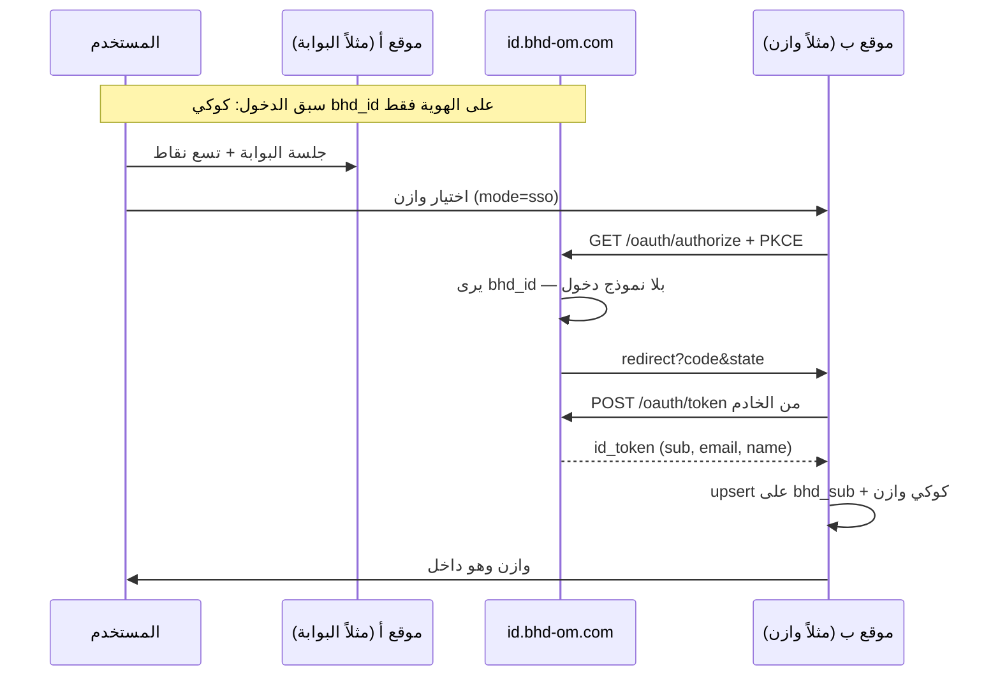

# الدليل المرجعي — الدخول الموحّد ومشغّل تطبيقات BHD

> **الحالة:** مرجع تشغيلي معتمد لكل المواقع الحالية والمستقبلية.  
> **المصدر الوحيد:** هذا الملف في [ainoamn/ONE-BHD](https://github.com/ainoamn/ONE-BHD) — `docs/BHD-UNIFIED-LOGIN-AND-APPS.md`  
> **التاريخ:** 19 أغسطس 2026  
> **الإصدار:** `bhd-unified-login-apps.v1`  
> **المواصفات البروتوكولية (لا تُحرَّف):**  
> - [`BHD-IDENTITY-SSO.md`](BHD-IDENTITY-SSO.md) — `bhd-identity.v1`  
> - [`BHD-APP-SWITCHER.md`](BHD-APP-SWITCHER.md) — `bhd-appswitcher.v1`  
> **الناشر:** بوابة BHD — مشروع Vercel `one-bhd` — المُصدِر `https://id.bhd-om.com`

انسخ هذا الملف إلى مستودع كل منتج تحت `docs/BHD-UNIFIED-LOGIN-AND-APPS.md`. بعد تثبيت الدخول والمشغّل **املأ القسم 12 الخاص بموقعك**: كيف ثبّتت، كيف يعمل، والتقنيات الكاملة لبناء ذلك الموقع. لا تحذف أقسام المواقع الأخرى. المرجع الحي لهذه القواعد هو البوابة `BHD-Complete-Brand-and-Portal-v1.1.0`.

---

## 0. ماذا يوحَّد وماذا يبقى محلياً

| يوحَّد على الهوية | يبقى داخل كل منتج |
|---|---|
| إنشاء الحساب (بريد / اسم مستخدم / Google) | الفواتير والاشتراكات التشغيلية |
| شاشة الدخول `/login` | المحافظ، الكاشير، الشجرة، العقارات، الطلبات |
| صفحة الملف `/account` | الأدوار والصلاحيات داخل التطبيق |
| مشغّل التطبيقات (تسع نقاط) | قاعدة بيانات المنتج ونشره |
| معرّف المستخدم `sub` | جلسة المنتج على نطاقه فقط |

المستخدم يدخل مرة على الهوية. بعد ذلك التنقل بين المواقع **لا يعيد نموذج كلمة المرور** إن كانت جلسة الهوية قائمة. النظام يثبت الحساب في الموقع الجديد بربط `bhd_sub` دون إنشاء كلمة مرور ثانية.

---

## 0.1 الهوية البصرية والتصميم — إلزامي لكل موقع

كل مواقع المجموعة (الحالية والمستقبلية) تستخدم **نفس الهوية البصرية وطريقة التصميم** كما في البوابة الحية ودليل [`BHD-BRAND-IDENTITY`](../BHD-Complete-Brand-and-Portal-v1.1.0/docs/BHD-BRAND-IDENTITY.md) وصفحة `/brand`.

| الرمز | القيمة على البوابة |
|---|---|
| الحبر | `#092d24` (`--ink`) |
| الأخضر | `#075c45` (`--emerald`) |
| الرمل/الخلفية | `#fbfaf7` / `#f4f0e8` |
| الخط العربي | IBM Plex Sans Arabic |
| الاتجاه | RTL للعربية |
| الشعار | ملفات `/brand/bhd-logo.svg` و`bhd-mark.svg` الرسمية — لا شعار بديل |
| الزوايا والهدوء | بطاقات بحدود `#d7e2dc` وظل خفيف كما في البوابة |

لا يُبتكر نظام ألوان محلي لكل منتج. لون تمييز المنتج (وازن، نَسَب…) يُستخدم داخل أيقونة البرنامج فقط، لا لإعادة طلاء الموقع كله.

كل موقع يعرض نبذة الشركة ورابط **عن الشركة** و**هوية الشركة** (على البوابة: `/about` و`/brand`). المواقع الأخرى تنسخ المحتوى أو تربط صفحتي البوابة إن لم تُبنَ محلياً بعد.

---

## 0.2 الجلسة: خمول 48 ساعة، حساب واحد، الإدارة

**الخمول.** بعد **48 ساعة بلا استخدام** يُسجَّل الخروج تلقائياً. أي استخدام (نقرة، لوحة مفاتيح، إعادة إظهار التبويب، طلب `/api/auth/me`) يجدّد النافذة 48 ساعة أخرى. المرجع في البوابة: `SESSION_IDLE_MAX_AGE_SEC` و`SessionKeepAlive` وتجديد الكوكي في `GET /api/auth/me`. المنتج يطبّق النافذة نفسها على **جلسته المحلية**، وتبقى جلسة الهوية على `id` بنفس القاعدة حتى يبقى التنقل الصامت متسقاً.

**حساب واحد لكل متصفح — إلزامي.** لا يُسمح بجلستين لحسابين في نفس المتصفح (نفس الملف الشخصي) في **أي** موقع من المجموعة في الوقت نفسه.

- الدخول يحدث فقط على `https://id.bhd-om.com`. `/login` و`/account` و`/admin` و`/oauth` على `www` أو `one-bhd.vercel.app` تُحوَّل إلى مضيف الهوية حتى لا تنشأ كوكي ثانية.
- لا قائمة «إضافة حساب». إن كانت جلسة الهوية قائمة يظهر تنبيه: اخرج ثم ادخل بالحساب الآخر.
- المنتجات (وازن، حسابي، نَسَب، بيتك، المتجر، المكتب) **ممنوع** أن تُبقي دخولاً محلياً مستقلاً (جوجل/كلمة مرور/أدمن محلي) بجانب هوية BHD. مسار `/admin` في المنتج لنفس `bhd_sub` فقط.
- عند `callback` SSO: امسح أي جلسة منتج سابقة واستبدلها بالمستخدم القادم من الهوية. لا تُبقَ مستخدم أدمن قديم إن دخل حساب BHD مختلف.
- لتغيير الحساب: خروج موحّد من الهوية (`/oauth/end-session`) يمسح `bhd_id` ثم يجب أن يمسح المنتج جلسته. بعدها فقط يُسمح بدخول جديد.

هذه الفقرة جزء من المواصفة. مخالفتها (مثل فتح `wazen.bhd-om.com/admin` بحساب بينما `id` بحساب آخر) تُعدّ عيباً في تثبيت المنتج لا في الهوية.

**الإدارة.** صفحات إعدادات الأدمن (`/admin` على الهوية، ولوحات الأدمن داخل كل منتج) **للمدير فقط**. دخول الإدارة من المنتج: `GET /api/auth/admin-entry` (القسم 4.9) وليس `/login?local=1`. على البوابة: `BHD_PLATFORM_ADMIN_EMAILS` و`requirePlatformAdmin` — غير المدرج يرى منعاً صريحاً. أدوار منتج تبقى جداول ذلك المنتج ولا تُفتح من الهوية. التفصيل والتشخيص: القسم **0.7**.

---

## 0.3 التحميل المسبق والتنقل السلس

عند أول تحميل يُسخَّن التطبيق في الخلفية: `NavigationWarmup` يستدعي `router.prefetch` لكل الصفحات العامة (`/`, المنتجات، `/apps`, `/about`, `/brand`, `/login`, `/account`…). الروابط `InstantLink` مع `prefetch`. النتيجة: الانتقال الداخلي يبدو كأنه محمّل مسبقاً. كل موقع ينفّذ التسخين لصفحاته هو، لا لصفحات منتج آخر.

---

## 0.4 المزامنة الفورية — ماذا ينعكس وما لا

| ينعكس فوراً عبر الهوية (حاسوب ↔ هاتف) | لا ينعكس بين المواقع |
|---|---|
| الاسم، البريد، الهاتف، العنوان، الصورة في `/account` | فواتير حسابي، محافظ وازن، طلبات المتجر، شجرة نَسَب، عقارات بيتك |
| قائمة المواقع المرتبطة بالحساب | اشتراكات ذلك المنتج وخططه |
| حالة الدخول على الهوية (بعد SSO) | أدوار المشرف داخل المنتج |

المصدر: Neon `bhd-identity` بلا كاش على `/api/account` و`/oauth/userinfo`. تعديل على الهاتف يظهر على الكمبيوتر في الطلب التالي لنفس واجهات الهوية. بيانات التشغيل تُزامَن داخل **قاعدة ذلك المنتج** فقط (آليات المنتج: ويب سوكت/استعلام حي — ليست مسؤولية الهوية).

---

## 0.5 الفوتر: برامجنا وشرح التطبيقات

في أسفل **كل** موقع (مرجع البوابة: `SiteFooter`):

1. صف **برامجنا** بشعار واسم كل تطبيق.
2. رابط «كل التطبيقات وشرحها» إلى صفحة `/apps` (أو المكافئ).
3. روابط: عن الشركة، هوية الشركة، الخصوصية، الشروط، الأمان.

صفحة `/apps` على البوابة تشرح لكل برنامج: الشعار، الاسم، الفئة، الفوائد، كيف يعمل، ورابط الفتح. المواقع الأخرى تنسخ المكوّن والصفحة أو تربط `https://www.bhd-om.com/apps` إلى أن تُبنَى الصفحة محلياً بنفس المحتوى.

## 0.6 الموقع العام: لا روابط مصدر خاص

صفحات [www.bhd-om.com](https://www.bhd-om.com/) لا تعرض كلمة «مستودع المشروع» ولا أي رابط إلى GitHub أو مصدر خاص. روابط المنتجات تذهب إلى نطاقات `*.bhd-om.com` فقط. النظام الداخلي (مكتب BHD) يفتح صفحة المنتج داخل البوابة لا مصدره.

---

## 0.7 تشخيص: لوحات قديمة، تنقّل يطلب دخولاً، أدمن المنتج

### ماذا يحدث فعلياً (لماذا يبدو «مكسوراً»)

| العرض | السبب الحقيقي | الإصلاح في مستودع المنتج |
|---|---|---|
| الموقع ما زال يعرض لوحة تسجيل قديمة | المنتج لم يحوّل `/login` إلى `/api/auth/bhd/start`، أو ما زال فيه جوجل/كلمة مرور محلية | غلاف دخول فقط → الهوية؛ أزل النموذج المحلي للمستخدم النهائي |
| دخلت موقعاً ثم الآخر يطلب دخولاً | إما `mode=browse` (لا يمرّ بـ authorize)، أو لا يوجد `start`/`callback`، أو الدخول كان محلياً فلم تُضبط كوكي `bhd_id` على `id.bhd-om.com` | أكمل القسم 4؛ تأكد أن أول دخول يمر عبر `id`؛ بعد نجاح `start` بـ 302 أبلغ ONE-BHD لقلب `mode` إلى `sso` |
| حساب الأدمن القديم يقول «غير موجود / خطأ» عند الدخول الموحّد | الأدمن كان صفاً محلياً بكلمة مرور المنتج فقط؛ الهوية لا تعرف ذلك الصف؛ أو `callback` أنشأ مستخدماً جديداً بلا دور `admin` | اربط الصف القديم بـ `bhd_sub` (انظر أدناه) — لا تُبقِ دخول أدمن محلي موازياً |

التنقّل الصامت **لا يعني** أن كوكي وازن تُقرأ في نَسَب. يعني: كوكي `bhd_id` على الهوية → `authorize` بلا نموذج → `callback` يضبط جلسة المنتج. إن لم يمر المنتج بهذا المسار فسيطلب دخولاً دائماً.

### الخلاصة التقنية المعتمدة — الأدوار (الأنسب والآمن)

**لا توحّد صلاحية «أدمن كل المواقع» في حساب واحد افتراضياً.** ذلك خطر أمني: اختراق حساب واحد يفتح وازن وحسابي والمتجر والمكتب معاً. الهوية تثبت **من أنت**؛ كل منتج يقرر **ماذا يحق لك** داخل جداوله.

| الطبقة | أين تُدار | من يدخلها |
|---|---|---|
| هوية واحدة | `id.bhd-om.com` — حساب / بريد / Google / Facebook | كل المستخدمين |
| أدمن المنصة (الهوية فقط) | `BHD_PLATFORM_ADMIN_EMAILS` → `/admin` على الهوية | مالكو المنصة فقط — مستخدمون ونظرة عامة للهوية، **ليس** أدمن وازن أو المتجر |
| أدمن المنتج | عمود/جدول دور داخل قاعدة ذلك المنتج (`role=admin`، `is_admin`، عضوية شركة…) مربوط بنفس `bhd_sub` | من عيّنه مالك ذلك المنتج |

النموذج الصحيح لمشرف وازن مثلاً:

1. يملك حساباً على الهوية (نفس البريد الذي كان أدمن وازن المحلي إن أمكن).
2. يدخل عبر `admin-entry` → SSO → `callback`.
3. المنتج يربط أو ينشئ الصف على `bhd_sub`، ويُبقي/يمنح دور `admin` **في جدول وازن فقط**.
4. في نَسَب أو المتجر يظهر كمستخدم عادي ما لم يُعيَّن أدمن هناك أيضاً.

متى يكون «أدمن واحد لكل المواقع» مقبولاً؟ فقط لمالك المنصة، وبقرار صريح: نفس البريد يُدرَج في قائمة أدمن **كل** منتج على حدة (أو سكربت تعيين)، لا عبر مفتاح سحري في الهوية يفتح كل شيء. حتى حينها تبقى الصلاحية محلية لكل قاعدة بيانات.

### آلية ربط أدمن قديم بهوية BHD (إلزامي في `callback`)

```
بعد التحقق من id_token:
1. إن وُجد مستخدم bhd_sub = sub → حدّث الملف وافتح الجلسة (احتفظ بدوره).
2. وإلا إن وُجد مستخدم بنفس البريد الموثّق (أو اسم مستخدم أدمن معروف) و bhd_sub فارغ
   → اكتب bhd_sub = sub، احتفظ بـ role/admin كما هو، امسح اعتماد كلمة المرور المحلية للدخول العام إن لزم.
3. وإلا → أنشئ مستخدماً جديداً بدور افتراضي (مستخدم) — ليس أدمن تلقائياً.
4. امسح أي جلسة منتج سابقة قبل ضبط الكوكي الجديدة.
```

تعيين أدمن جديد لاحقاً: من لوحة `/admin` داخل المنتج (أو SQL/سكربت مالك المنتج) على الصف المرتبط بـ `bhd_sub` — **ليس** من شاشة الهوية.

### قائمة تحقق سريعة لكل موقع ما زال يعاني

1. لا لوحة تسجيل قديمة للمستخدم النهائي — فقط تحويل إلى الهوية.
2. `GET /api/auth/bhd/start` و`callback` يعملان؛ authorize يفتح `id.bhd-om.com` لا أصل المنتج.
3. الكتالوج في ONE-BHD: `mode: "sso"` لذلك المنتج بعد التحقق.
4. مشغّل التطبيقات يفتح عبر `startUrl` لا رابط تسويقي عارٍ فقط.
5. `/admin` عبر `/api/auth/admin-entry`؛ ربط الأدمن القديم بـ `bhd_sub` كما أعلاه.
6. اختبار: دخول الهوية → فتح منتج ثانٍ → بلا نموذج كلمة مرور → نفس الشخص؛ فتح `/admin` إن كان الدور محلياً admin.

دليل لصق جاهز للمنتجات: [`BHD-PRODUCT-SSO-ADMIN.md`](BHD-PRODUCT-SSO-ADMIN.md).

---

## 1. لماذا يعمل التنقل دون إعادة تسجيل (بدون مخاطرة)

الكوكي **لا يُشارك** عبر النطاقات. لا `Domain=.bhd-om.com`. لا `iframe`. لا قاعدة بيانات مشتركة.

ما يحدث فعلياً:

1. عند أول دخول ناجح على `id.bhd-om.com` تُضبط كوكي هوية اسمها `bhd_id`، **Host-only** على مضيف الهوية فقط، **48 ساعة خمول منزلق**، `HttpOnly` + `Secure` + `SameSite=Lax`.
2. عندما يفتح المستخدم منتجاً آخر (مثلاً وازن) يذهب المتصفح إلى `{origin}/api/auth/bhd/start` ثم إلى  
   `https://id.bhd-om.com/oauth/authorize?...`
3. الهوية ترى كوكي `bhd_id` لأنها على **نفس المضيف** الذي ضبطها. لا تحتاج كلمة مرور.
4. تصدر كود تفويض لمرة واحدة (60 ثانية) وترجع المنتج إلى `/api/auth/bhd/callback`.
5. خادم المنتج يستبدل الكود بتوكن على `POST /oauth/token`، يتحقق من `id_token`، يربط أو ينشئ مستخدمه المحلي بـ `bhd_sub = sub`، ثم يضبط **كوكي جلسة ذلك المنتج** على نطاقه وحده.

لذلك: الدخول السابق إلى **أي** موقع يمر عبر الهوية يكفي للتنقل اللاحق. الموقع الجديد لا يقرأ كوكي الموقع القديم؛ يثق بتوكن صادر من الهوية بعد PKCE.

إن لم تكن جلسة `bhd_id` قائمة (خروج موحّد، أو متصفح آخر، أو انتهاء 7 أيام) تظهر شاشة `/login` مرة واحدة ثم يعود المنتج.



---

## 2. قيم مجمّدة — لا تغيّرها في أي مستودع

| المفتاح | القيمة |
|---|---|
| مواصفة الهوية | `bhd-identity.v1` |
| مواصفة المشغّل | `bhd-appswitcher.v1` |
| Issuer | `https://id.bhd-om.com` |
| اكتشاف OIDC | `https://id.bhd-om.com/.well-known/openid-configuration` |
| شاشة الدخول | `https://id.bhd-om.com/login` |
| صفحة الحساب | `https://id.bhd-om.com/account` |
| لوحة المنصة | `https://id.bhd-om.com/admin` |
| مشروع Vercel للهوية | `one-bhd` — Root Directory: `BHD-Complete-Brand-and-Portal-v1.1.0` |
| مستودع الهوية | `ainoamn/ONE-BHD` |
| Neon | مشروع `bhd-identity` — جداول الهوية فقط |
| PKCE | `S256` إلزامي |
| scopes | `openid profile email` |
| صلاحية الكود | 60 ثانية، استخدام واحد |
| صلاحية ID/Access Token | 10 دقائق |
| صلاحية Refresh | 30 يوماً مع تدوير |
| صلاحية `bhd_id` | 48 ساعة خمول منزلق (أي استخدام يجدّد) |
| DNS للنطاقات الفرعية | CNAME → `cname.vercel-dns.com` (**ليس** `vercel-dns-017`) |

### 2.1 `client_id` و`redirect_uri` الإنتاج

| المنتج | `client_id` | الأصل | callback الإنتاج |
|---|---|---|---|
| البوابة | `bhd-portal` | `https://www.bhd-om.com` | `https://www.bhd-om.com/api/auth/bhd/callback` |
| وازن | `bhd-wazen` | `https://wazen.bhd-om.com` | `https://wazen.bhd-om.com/api/auth/bhd/callback` |
| حسابي | `bhd-hisaby` | `https://hisaby.bhd-om.com` | `https://hisaby.bhd-om.com/api/auth/bhd/callback` |
| نَسَب | `bhd-nasab` | `https://nasab.bhd-om.com` | `https://nasab.bhd-om.com/api/auth/bhd/callback` |
| المتجر | `bhd-store` | `https://bhdstor.bhd-om.com` | `https://bhdstor.bhd-om.com/api/auth/bhd/callback` |
| بيتك | `bhd-baitak` | `https://baitak.bhd-om.com` | `https://baitak.bhd-om.com/api/auth/bhd/callback` |
| المكتب | `bhd-office` | داخلي | `{origin}/api/auth/bhd/callback` |

محلياً يُسمح أيضاً بـ `http://localhost:3000/api/auth/bhd/callback` (وازن أيضاً `:3001`). المقارنة **مطابقة تامة**.

`hisaby.pro` نطاق إضافي لحسابي وليس عنصراً في المشغّل. `bhd-ain-oman` يُعامل كاسم قديم لـ `bhd-baitak` إن وُجد في حل العميل.

### 2.2 كوكيز — أسماء ثابتة

| الاسم | أين | Domain | الغرض |
|---|---|---|---|
| `bhd_id` | الهوية فقط | Host-only | جلسة مزوّد الهوية |
| `bhd_portal` | البوابة (نفس التطبيق) | Host-only | جلسة البوابة؛ تُضبط مع `bhd_id` على هذا المضيف |
| `bhd_oauth_state` | المنتج، 5 دقائق | Host-only | `state` + `nonce` + `code_verifier` أثناء التحويل |
| جلسة المنتج | ذلك المنتج | Host-only | اسم الكوكي الحالي للمنتج (لا تستخدم `bhd_id`) |

ممنوع: `Domain=.bhd-om.com`. SSO يعمل لأن التحويل يصل إلى مضيف الهوية فيرى كوكيه.

### 2.3 مطالبات ID Token

إلزامي: `iss`, `aud`, `sub`, `exp`, `iat`, `nonce`, `email`, `email_verified`  
اختياري: `name`, `picture`, `preferred_username`, `phone_number`

التحقق على **خادم المنتج**: `iss` === Issuer، `aud` === `client_id` الخاص به، `nonce` يطابق الكوكي، `email_verified === true`. رفض توكن `aud` لمنتج آخر.

---

## 3. بناء شاشة الدخول الموحّدة (الموقع الرئيسي)

هذه الشاشة **واحدة** لكل المنظومة. المنتجات لا تبني نموذجاً موازياً بعد الربط؛ `/login` عندهم غلاف يحوّل إلى `/api/auth/bhd/start`.

### 3.1 العنوان والسلوك

- المسار: `https://id.bhd-om.com/login` (ونفس التطبيق على `www.bhd-om.com/login` لأنهما مشروع واحد؛ الكوكي Host-only فادخل من المضيف الذي ستستخدمه).
- `noindex, noarchive` و`Cache-Control: private, no-store`.
- إن وُجد `?next=` وكان مساراً آمناً يبدأ بـ `/` يُعاد إليه بعد النجاح. مسار التفويض يُمرَّر هكذا: `/login?next=/oauth/authorize?...` حتى يعود المستخدم لإكمال SSO دون إعادة كتابة المعامل.

### 3.2 ماذا تعرض الشاشة

1. لوحة **بوابة BHD** بنص موحّد: «من هنا تبدأ الخطوة نحو أحلام أكبر» ثم وعد **Build Higher Dreams**. اسم **بن حمود للتطوير** / **Bin Hamood Development** يظهر بلون ذهبي. النص موسّط ومتجاوب (`clamp` + عمود واحد تحت 900px).
2. دخول بالبريد أو اسم المستخدم + كلمة المرور (`POST /api/auth/login`).
3. إنشاء حساب (`POST /api/auth/register`) مع دفتر عنوان SELF اختياري (هاتف، مدينة…).
4. زر Google **على هذه الشاشة فقط** — GIS / `POST /api/auth/google` يتحقق من ID Token على الخادم بـ `google-auth-library`.
5. لا زر Google على وازن أو حسابي بعد القطع.

كلمة المرور في الهوية: `bcryptjs` rounds `12`. القفل بعد 5 محاولات فاشلة لمدة 15 دقيقة.

عميل Google العام (آمن في الواجهة):

`162957418455-d734efb8n4oe0ba5e664583a255ks50t.apps.googleusercontent.com`

### 3.3 نقاط نهاية الهوية التي تبني عليها الشاشة والمنتجات

| الطريقة | المسار | من يستدعيه |
|---|---|---|
| GET | `/.well-known/openid-configuration` | أي عميل |
| GET | `/oauth/jwks.json` | التحقق من التوكن (لاحقاً RS256) |
| GET | `/oauth/authorize` | متصفح المنتج بعد `start` |
| POST | `/oauth/token` | **خادم** المنتج فقط |
| GET | `/oauth/userinfo` | خادم المنتج بـ Bearer |
| GET | `/oauth/end-session` | خروج موحّد |
| GET | `/login` | الإنسان |
| GET | `/account` | الإنسان بعد الدخول |
| GET/PATCH | `/api/account` | صفحة الحساب (جلسة هوية) |
| POST | `/api/auth/login` `/register` `/google` `/logout` | شاشة الهوية |

`/oauth/authorize` إن وُجدت جلسة يصدر الكود فوراً (هنا يحدث «الدخول المباشر» عند التنقل). إن لم توجد يحوّل إلى `/login?next=...`.

عملاء الطرف الأول (`first_party`) يتجاوزون شاشة الموافقة بعد أول نجاح لنفس `client_id`+`sub`. حتى تُضبط أسرار لكل عميل، يجوز لعميل الطرف الأول إكمال `authorization_code` بـ PKCE دون `client_secret`.

### 3.4 صفحة الحساب `/account`

ليست بطاقة الرأس الصغيرة. بعد «الحساب» في المشغّل:

- بيانات الملف (اسم، بريد غير قابل للتعديل من هنا، هاتف، عنوان)
- المواقع المرتبطة من الكتالوج + تذاكر OAuth إن وُجدت
- الاشتراكات: فارغة حتى يبلّغ المنتج عنها؛ فواتير المنتج **لا تُعرض هنا**
- الحفظ يكتب `bhd_users` و`bhd_contacts` (SELF). المنتجات تأخذ الاسم/الهاتف من التوكن أو `userinfo` عند الدخول التالي

### 3.5 مشغّل التطبيقات بعد الدخول

- يظهر فقط مع جلسة صالحة.
- يسار الصورة في RTL: تسع نقاط ثم الأفاتار.
- الكتالوج المجمد `lib/bhd/apps.ts` — لا قائمة محلية.
- `mode: "sso"` → `{origin}/api/auth/bhd/start?returnTo=/`
- `mode: "browse"` → أصل الموقع فقط (المنتج لم يُكمل القسم 6)
- `mode: "identity"` → `/account` على البوابة/الهوية وإلا `https://id.bhd-om.com/account`
- رابط الحساب من منتج آخر: دائماً `https://id.bhd-om.com/account`
- الخروج: مسح جلسة **هذا** المنتج ثم `end-session` على الهوية
- الملفات: `BhdAppSwitcher.tsx` + `BhdAppIcon.tsx` + أنماط `.bhd-switcher-*`

قلب `mode` من `browse` إلى `sso` يتم **فقط في ONE-BHD** بعد أن يرد `GET {origin}/api/auth/bhd/start` بـ 302 إلى الهوية، ثم يُنسخ `apps.ts`.

---

## 4. كيف يبني موقع جديد الربط (كل التفاصيل)

خطط جاهزة للمنتجات: [`BHD-WAZEN-INTEGRATION.md`](BHD-WAZEN-INTEGRATION.md) و[`BHD-STORE-INTEGRATION.md`](BHD-STORE-INTEGRATION.md). هذا القسم عام لكل موقع حالي أو مستقبلي.

### 4.1 قبل الكود

1. سجّل `client_id` من جدول 2.1 في الهوية (موجود للأسماء الحالية؛ موقع جديد يُضاف في `app/lib/identity/clients.ts` في ONE-BHD أولاً).
2. DNS: نطاق المنتج CNAME → `cname.vercel-dns.com`.
3. أسرار المنتج على Vercel **ذلك** المشروع فقط. لا تنسخ `DATABASE_URL` الهوية.

### 4.2 متغيرات المنتج

```env
BHD_IDENTITY_ISSUER=https://id.bhd-om.com
BHD_OAUTH_CLIENT_ID=bhd-<product>
BHD_OAUTH_CLIENT_SECRET=
BHD_OAUTH_REDIRECT_URI=https://<host>/api/auth/bhd/callback
```

سر جلسة المنتج (`AUTH_SECRET` المحلي) مختلف عن `AUTH_SECRET` الهوية.

### 4.3 قاعدة المنتج

```sql
ALTER TABLE <users> ADD COLUMN bhd_sub UUID UNIQUE;
CREATE INDEX IF NOT EXISTS users_bhd_sub_idx ON <users>(bhd_sub);
```

لا جداول `bhd_users`. لا حذف أعمدة البريد/جوجل قبل الترحيل.

### 4.4 `GET /api/auth/bhd/start`

1. ولّد `state`, `nonce`, `code_verifier` (43–128 حرف unreserved).
2. `code_challenge = BASE64URL(SHA256(verifier))`.
3. كوكي `bhd_oauth_state` HttpOnly: `{ state, nonce, verifier, returnTo }`.
4. حوّل إلى **`https://id.bhd-om.com/oauth/authorize`** — ليس إلى أصل المنتج.

**خطأ شائع:** نسخ مسار البوابة الذي يستخدم `{origin}/oauth/authorize` لأن البوابة **هي** الهوية. المنتج يجب أن يستخدم الـ Issuer.

`returnTo` نسبي آمن فقط. من المشغّل دائماً `/`.

### 4.5 `GET /api/auth/bhd/callback`

1. اقرأ الكوكي واحذفها فوراً.
2. طابق `state`. ارفض `error`.
3. من **الخادم**: `POST {ISSUER}/oauth/token` مع `code` + `code_verifier` + `redirect_uri` + `client_id`.
4. تحقق `id_token` (قسم 2.3).
5. upsert مستخدم المنتج على `bhd_sub`.
6. أصدر كوكي جلسة المنتج. حوّل إلى `returnTo`.

ترتيب المطابقة (أوقف عند أول نجاح): صف `bhd_sub` → بريد **موثّق** مطابق → إنشاء صف منتج جديد بلا كلمة مرور محلية. لا تطابق بريداً غير موثّق ولا اسم مستخدم وحده. لا تستورد هاش كلمة المرور.

### 4.6 الخروج

امسح جلسة المنتج ثم:

```
{ISSUER}/oauth/end-session?client_id={CLIENT_ID}&post_logout_redirect_uri={https://product-origin/}
```

`post_logout_redirect_uri` مسجّل مسبقاً في عميل الهوية.

### 4.7 بعد نجاح OIDC — المشغّل

انسخ من `BHD-Complete-Brand-and-Portal-v1.1.0/` في ONE-BHD: `apps.ts` و`BhdAppSwitcher` و`BhdAppIcon` وCSS. ركّب بجانب الأفاتار بعد الجلسة فقط. أزل زر Google المحلي.

### 4.8 أبلغ الهوية

عندما يعمل `start` بـ 302 إلى الهوية: أبلغ ONE-BHD لقلب `mode` إلى `"sso"` وإعادة نسخ الكتالوج.

### 4.9 دخول الإدارة — `GET /api/auth/admin-entry` (Checklist سريع)

لا ترسل المشرف إلى `/login?local=1&next=/admin`. ذلك يفتح كلمة مرور محلية ويكسر الحساب الواحد. انسخ الملف المرجعي:

`BHD-Complete-Brand-and-Portal-v1.1.0/app/api/auth/admin-entry/route.ts`

يحوّل إلى `{origin}/api/auth/bhd/start?returnTo=/admin` (نفس جلسة هوية BHD).

| خطوة | ماذا تفعل |
|---|---|
| 1 | انسخ `app/api/auth/admin-entry/route.ts` إلى المنتج |
| 2 | في صفحة `/login` (أو `/auth/login`) إن وُجد `local=1` و`next` يبدأ بـ `/admin` → `redirect("/api/auth/admin-entry")` |
| 3 | أي Gate يمنع `/admin`: زر الدخول = `/api/auth/admin-entry` لا `/login?local=1…` |
| 4 | رابط «دخول أدمن» في الفوتر = `/api/auth/admin-entry` |
| 5 | إن لم يكن مسار الإدارة `/admin` مرّر `?next=/المسار` أو غيّر القيمة الافتراضية في الملف |

مسارات الإدارة المعتمدة اليوم:

| الموقع | مسار الإدارة | `returnTo` |
|---|---|---|
| الهوية / البوابة | `/admin` | `/admin` |
| وازن | `/admin` | `/admin` |
| نَسَب | `/admin` | `/admin` |
| حسابي | أكّد المسار في مستودع حسابي إن لم يكن `/admin` | |
| المتجر | `/dashboard/admin` | `/dashboard/admin` (افتراضي `admin-entry`) |
| بيتك / المكتب | أكّد المسار إن اختلف | |

بعد `callback` امسح جلسة المنتج السابقة. `/admin` لنفس `bhd_sub` فقط. لربط أدمن محلي قديم أو سياسة الأدوار الآمنة اتبع القسم **0.7**.

---

## 5. ما يُحظر (مخاطر مرفوضة)

- مشاركة `DATABASE_URL` بين موقعين.
- `Domain=.bhd-om.com` «لتسهيل» الدخول.
- `iframe` أو `postMessage` بين الأصول.
- زر Google على المنتج بعد الربط.
- منح أدوار مدير من الهوية.
- جلب كتالوج المشغّل من شبكة خارجية في v1 (الملف المجمد).
- فتح تطبيق المشغّل في تبويب جديد.
- تغيير `returnTo` إلى مسار داخلي لموقع آخر.
- بناء تسجيل مستخدم نهائي جديد في المنتج.
- نسخ قائمة المنتجات التسويقية بدل `apps.ts`.

---

## 6. تقنيات الموقع الرئيسي (الهوية + البوابة) — مرجع صيانة

يُحدَّث هذا القسم عند تغيير جوهري في `one-bhd`. الفرق الأخرى لا تعدّله إلا بإضافة سجلها في القسم 12.

| الطبقة | التقنية | كيف تُستخدم |
|---|---|---|
| الإطار | Next.js `16.2.6` (App Router) + React `19.2.6` | صفحات `/login` `/account` `/admin` ومسارات `/oauth/*` |
| اللغة | TypeScript `5.9.3` | النوع الصارم في البناء على Vercel |
| التشغيل | Node.js `>=22.13` | `runtime = "nodejs"` لمسارات الهوية |
| النشر | Vercel مشروع `one-bhd` | Root Directory المجلد `v1.1.0`؛ نطاقات `www` و`id` و`one-bhd.vercel.app` |
| DNS | Hostinger NS + CNAME `cname.vercel-dns.com` | تجنّب عناوين Vercel المكسورة من عُمان |
| الهوية البصرية | IBM Plex Sans Arabic + Inter عبر `next/font` | RTL افتراضي |
| الأنماط | `app/globals.css` (ليست Tailwind في واجهة الهوية الأساسية) | بادئة المشغّل `bhd-switcher-` |
| قاعدة الهوية | PostgreSQL على Neon (`bhd-identity`، AWS eu-west-2) | pooled `DATABASE_URL` على Vercel |
| ORM | Drizzle ORM `0.45.2` + drizzle-kit `0.31.10` + `postgres` | `db/schema.ts`: `bhd_users`, `bhd_contacts`, `bhd_oauth_tickets` |
| كلمة المرور | `bcryptjs` rounds 12 | تسجيل/دخول الهوية فقط |
| الجلسة | JWT HS256 عبر `jose` | كوكي `bhd_id` / `bhd_portal` |
| OIDC | Authorization Code + PKCE S256 | `jose` لتوقيع/تحقق التوكن؛ مؤقتاً HS256 بـ `IDENTITY_TOKEN_SECRET` حتى JWKS RS256 |
| Google | GIS في المتصفح + `google-auth-library` على الخادم | على مضيف الهوية فقط |
| الاختبار | `node --test` على `tests/rendered-html.test.mjs` | لا يشغّل قاعدة حية |
| الأمان | CSP `default-src 'self'`، HSTS، `frame-ancestors 'none'`، `X-Frame-Options: DENY` | Google في CSP: `accounts.google.com` وصور `*.googleusercontent.com`؛ COOP `same-origin-allow-popups` |

ملفات مفتاحية للصيانة:

| الملف | الدور |
|---|---|
| `app/login/LoginForm.tsx` | شاشة الدخول الموحّدة |
| `app/account/AccountConsole.tsx` | الملف والمواقع المرتبطة |
| `app/oauth/authorize/route.ts` | إصدار الكود إن وُجدت جلسة — هنا التنقل الصامت |
| `app/oauth/token/route.ts` | استبدال الكود/التحديث |
| `app/oauth/userinfo/route.ts` | قراءة الملف الحي للمنتجات |
| `app/api/auth/bhd/start/route.ts` | SSO البوابة (يحوّل إلى origin لأنها الهوية) |
| `app/api/auth/admin-entry/route.ts` | دخول الإدارة → `start?returnTo=/admin` (يُنسخ للمنتجات) |
| `app/lib/bhd/apps.ts` | الكتالوج المجمد |
| `app/lib/identity/clients.ts` | تسجيل `redirect_uri` |
| `app/components/SiteFooter.tsx` | فوتر برامجنا + عن الشركة + الهوية |
| `app/apps/page.tsx` | شرح كل برنامج وفوائده وكيف يعمل |
| `app/components/auth/SessionKeepAlive.tsx` | تجديد الجلسة عند الاستخدام |
| `app/lib/auth/config.ts` | `SESSION_IDLE_MAX_AGE_SEC` = 48 ساعة |
| `db/schema.ts` | جداول Neon للهوية فقط |

---

## 7. اختبار ملزم قبل إعلان موقع «مربوط»

1. مستخدم جديد على الهوية → يدخل المنتج دون نموذج ثانٍ → `bhd_sub` = `sub`.
2. من البوابة بعد `mode=sso` يفتح المنتج دون كلمة مرور إن `bhd_id` قائمة.
3. مستخدم قديم ببريد موثّق مطابق → لا صف مكرر.
4. `state`/`nonce` خاطئ → رفض.
5. كود مستخدم مرتين → الثانية `invalid_grant`.
6. خروج المنتج ثم فتحه → يطلب دخولاً. خروج الهوية ثم منتج آخر → يطلب دخولاً.
6ب. خمول 48 ساعة بلا استخدام → خروج. استخدام خلال النافذة يجدّد.
6ج. لا يمكن جلستان لحسابين في نفس المتصفح.
6د. غير المدير لا يدخل `/admin` ولا إعدادات أدمن المنتج.
7. من عُمان: `id.bhd-om.com` يفتح.
8. بلا جلسة منتج: لا تسع نقاط.
9. «الحساب» من المنتج يفتح `https://id.bhd-om.com/account`.
10. بيانات التشغيل (فواتير/محافظ) لم تُمس ولم تُقرأ من Neon الهوية.

---

## 8. حالة الربط الحالية (تُحدَّث في ONE-BHD)

| الموقع | دخول OIDC | مشغّل | `mode` في الكتالوج | سجل الصيانة |
|---|---|---|---|---|
| الهوية / البوابة | نعم (هي المُصدِر) | نعم | portal `sso` | القسم 6 أعلاه + 12.1 |
| وازن | قيد التنفيذ | بعد OIDC | `browse` حتى إشعار ONE-BHD | 12.2 |
| حسابي | نعم (20 أغسطس 2026) | بعد جلسة المنتج | `browse` حتى قلب ONE-BHD | 12.3 · `HISABY-BHD-SSO-2026-08-20.md` |
| نَسَب | نعم | نعم | `sso` | 12.4 |
| بيتك | لم يُربط | — | `browse` | 12.5 |
| المتجر | نعم | نعم | `sso` | 12.6 |
| المكتب | معطّل في المشغّل | — | `enabled: false` | 12.7 |

---

## 9. صيانة الفرق — قواعد الكتابة في هذا الدليل

بعد تثبيت الخاصية على موقعك، **في نسخة الدليل داخل مستودعك** وفي نسخة ONE-BHD عند الدمج:

1. لا تعدّل الأقسام 0–7 إلا عبر طلب في ONE-BHD (قيم مجمّدة).
2. املأ قالب القسم 12 لموقعك: تاريخ التثبيت، الملفات المضافة، كيف يعمل التدفق عندكم، أسرار البيئة **بدون قيمها**، وتقنيات الموقع **كاملة** (إطار، لغة، قاعدة، نشر، مدفوعات إن وُجدت، طوابير…).
3. أي عطل SSO يُصلح أولاً في الهوية إن كان في `/oauth/*`؛ إن كان في `start`/`callback` يُصلح في مستودع المنتج.
4. تحديث قائمة التطبيقات: تغيير `apps.ts` في ONE-BHD ثم النسخ. لا اختراع تطبيق محلي.

---

## 10. رسائل لصق للوكلاء

**لهوية/بوابة (صيانة):** اقرأ هذا الملف والأقسام 0–7. لا تشارك قواعد المنتجات.

**لمنتج جديد:**

```text
المصدر: https://github.com/ainoamn/ONE-BHD/blob/main/docs/BHD-UNIFIED-LOGIN-AND-APPS.md
نفّذ القسم 4 ثم املأ القسم 12 لموقعك.
المواصفات: BHD-IDENTITY-SSO.md القسم 6 وBHD-APP-SWITCHER.md.
النطاق: دخول موحّد + مشغّل فقط. لا DATABASE_URL مشترك. لا Domain=.bhd-om.com. لا iframe. لا Google على المنتج.
authorize وtoken دائماً على https://id.bhd-om.com وليس أصل المنتج.
بعد نجاح start بـ 302 أبلغ ONE-BHD لقلب mode إلى sso.
```

---

## 11. مراجع مرتبطة

| الملف | متى يُقرأ |
|---|---|
| [BHD-IDENTITY-SSO.md](BHD-IDENTITY-SSO.md) | بروتوكول OIDC حرفياً |
| [BHD-APP-SWITCHER.md](BHD-APP-SWITCHER.md) | شكل المشغّل والكتالوج |
| [BHD-WAZEN-INTEGRATION.md](BHD-WAZEN-INTEGRATION.md) | بطاقة تنفيذ وازن |
| [BHD-STORE-INTEGRATION.md](BHD-STORE-INTEGRATION.md) | بطاقة تنفيذ المتجر |
| [BHD-NEON-DATABASE.md](BHD-NEON-DATABASE.md) | Neon الهوية فقط |
| [BHD-REPOSITORY-DOCUMENTATION.md](BHD-REPOSITORY-DOCUMENTATION.md) | نشر البوابة |

---

## 12. سجلات التثبيت والتقنيات لكل موقع

كل فريق يملأ جدوله بعد الإطلاق. الأقسام الفارغة متعمّدة حتى لا يُختلق توثيق غير موجود.

### 12.1 الهوية والبوابة — `ainoamn/ONE-BHD`

| البند | التوثيق |
|---|---|
| تاريخ التثبيت الحي | أغسطس 2026 — OIDC على `id.bhd-om.com` / `one-bhd` |
| كيف ثُبّت | نفس تطبيق البوابة يخدم الهوية؛ Neon `bhd-identity`؛ مسارات `/oauth/*` و`/login` و`/account` |
| كيف يعمل الدخول | `LoginForm` → جلسة `bhd_id` → `/oauth/authorize` يصدر كود إن وُجدت الجلسة |
| كيف يعمل التنقل | منتج آخر يستدعي authorize؛ الهوية لا تعرض نموذجاً إن `bhd_id` قائمة |
| كيف يعمل المشغّل | `SessionMenu` يحمّل `/api/auth/me` ثم `BhdAppSwitcher` |
| ملفات أُضيفت | انظر القسم 6 |
| أسرار (أسماء فقط) | `DATABASE_URL`, `AUTH_SECRET`, `IDENTITY_TOKEN_SECRET`, `GOOGLE_CLIENT_ID`, `FACEBOOK_APP_ID`, `FACEBOOK_APP_SECRET`, `BHD_PLATFORM_ADMIN_EMAILS`, أسرار العملاء `BHD_OAUTH_CLIENT_SECRET_*` |
| التقنيات الكاملة | القسم 6 |
| ملاحظات صيانة | لا تستخدم مسار `start` في البوابة كقالب لمنتج: البوابة تحوّل إلى `origin` |

### 12.2 وازن — `ainoamn/WAZEN`

| البند | التوثيق |
|---|---|
| تاريخ التثبيت | _يُملأ بعد الإطلاق_ |
| كيف ثُبّت | اتبع [BHD-WAZEN-INTEGRATION.md](BHD-WAZEN-INTEGRATION.md) — `client_id=bhd-wazen` |
| كيف يعمل الدخول | `start` → Issuer authorize → `callback` → جلسة وازن + `bhd_sub` |
| كيف يعمل التنقل الصامت | جلسة `bhd_id` على الهوية؛ وازن لا يرى كوكي البوابة |
| المشغّل | بعد OIDC؛ الحساب → `https://id.bhd-om.com/account` |
| أسرار (أسماء فقط) | `BHD_IDENTITY_ISSUER`, `BHD_OAUTH_CLIENT_ID`, `BHD_OAUTH_CLIENT_SECRET`, `BHD_OAUTH_REDIRECT_URI` + سر جلسة وازن |
| التقنيات الكاملة لوازن | _الإطار، القاعدة، المحافظ، النشر — يملأها فريق وازن_ |
| ما لم يُوحَّد | المحافظ، المصاريف، الرحلات، الجمعيات |

### 12.3 حسابي — `ainoamn/BHD-Pro` (qootk-pro-complete)

| البند | التوثيق |
|---|---|
| تاريخ التثبيت | 20 أغسطس 2026 — OIDC + غلاف دخول + `admin-entry` على `main`؛ إصلاح كوكي الجلسة عبر مسارات Next (نفس اليوم) |
| `client_id` | `bhd-hisaby` |
| نطاق BHD | `https://hisaby.bhd-om.com` (+ `hisaby.pro` / `bhd-pro.vercel.app` إضافي) |
| `redirect_uri` | `{origin}/api/auth/bhd/callback` (Host الواجهة → مسار Next يبروكسي Nest) |
| كيف ثُبّت | القسم 4 + **0.7** + **4.9**: `User.bhdSub` · Nest `BhdSsoController` · مسارات Next `app/api/auth/bhd/{start,callback,logout}` و`admin-entry` تبروكسي Nest وتعيد `Set-Cookie` Host-only · غلاف `/login`→SSO · `/register`→`id.bhd-om.com` · `returnTo=/`→`/dashboard` · ربط مستخدم قديم بالبريد مع الإبقاء على الدور · لا إنشاء شركة من الهوية |
| كيف يعمل الدخول | `start` → `https://id.bhd-om.com/oauth/authorize` → `callback` يستبدل الكود → تحقق `id_token` (HS256/JWKS) أو احتياطي `userinfo` → upsert على `bhd_sub` (يحفظ الدور) → كوكي الجلسة على الواجهة → `/dashboard` |
| ملفات `start` / `callback` | Nest: `backend/src/auth/bhd-sso.*` · Next: `frontend/src/app/api/auth/bhd/*` · `frontend/src/lib/bhd-sso-proxy.ts` · `admin-entry` |
| التنقل الصامت | كوكي `bhd_id` على مضيف الهوية فقط؛ حسابي لا يقرأ كوكي البوابة |
| الإدارة | منصة `/admin`: `PLATFORM_ADMIN_EMAILS` / `PlatformOperator` محلياً بعد SSO. أدمن شركة = `User.role=ADMIN` محلي مربوط بـ `bhd_sub`. مسار: `GET /api/auth/admin-entry` |
| جلسة المنتج | خمول منزلق 48 ساعة (كوكي refresh + صف Session) |
| أسرار (أسماء فقط) | `BHD_IDENTITY_ISSUER`, `BHD_OAUTH_CLIENT_ID`, `BHD_OAUTH_CLIENT_SECRET`, `BHD_IDENTITY_TOKEN_SECRET` (= `IDENTITY_TOKEN_SECRET` أو احتياطي الهوية `AUTH_SECRET`), `BHD_OAUTH_REDIRECT_URI` (اختياري), `JWT_*`, `FRONTEND_URL`, `CORS_ORIGIN`, `BACKEND_URL` (Vercel) |
| حادثة 23 أغسطس | `?bhd=verify` عند نقص السر؛ أُصلح باحتياطي userinfo + توثيق الحقول من ONE-BHD — `docs/HISABY-BHD-SSO-TOKEN-VERIFY-2026-08-23.md` |
| التقنيات الكاملة | Frontend: Next.js 15 · React · Tailwind · Vercel. Backend: NestJS 11 · Prisma · PostgreSQL (Neon) · Render `hisaby-api`. مصادقة منتج: JWT في كوكي. وحدات: محاسبة، POS، مطاعم، مخزون، فواتير… |
| ما لم يُوحَّد | الشركات، الفواتير، الضريبة، الكاشير، المطبخ، المخزون، أدوار الشركة |
| قلب `mode` إلى `sso` | يُطلب في ONE-BHD `apps.ts` بعد تحقق 302 حي لـ `start` + جلسة كوكي على الواجهة |
| مستودع التنفيذ | `ainoamn/BHD-Pro` · دليل: `docs/HISABY-BHD-SSO-2026-08-20.md` |

### 12.4 نَسَب — `ainoamn/Nasab`

| البند | التوثيق |
|---|---|
| تاريخ التثبيت الحي | 18–19 أغسطس 2026 — OIDC ثم المشغّل (`e1231cd` وما بعده) |
| `client_id` | `bhd-nasab` |
| الأصل | `https://nasab.bhd-om.com` (نسخة Vercel: `https://nasab-mu.vercel.app`) |
| `redirect_uri` | `https://nasab.bhd-om.com/api/auth/bhd/callback` + `https://nasab-mu.vercel.app/api/auth/bhd/callback` + `http://localhost:5173/api/auth/bhd/callback` |
| كيف ثُبّت | القسم 6 + **0.7** + **4.9** ثم المشغّل. الخطة في مستودع نَسَب: `docs/BHD-NASAB-INTEGRATION.md` · `docs/BHD-PRODUCT-SSO-ADMIN.md` |
| كيف يعمل الدخول | زر «تسجيل الدخول» → `GET /api/auth/bhd/start` → `https://id.bhd-om.com/oauth/authorize` (ليس أصل نَسَب) → `callback` يربط `bhd_sub` (يبقي دور الأدمن المحلي إن وُجد بالبريد) ويمسح جلسة المنتج السابقة → كوكي `kimi_sid` |
| كيف يعمل التنقل الصامت | كوكي `bhd_id` على مضيف الهوية فقط؛ نَسَب لا يقرأ كوكي البوابة |
| المشغّل | `AppHeader` بعد جلسة نَسَب فقط. «الحساب» → `https://id.bhd-om.com/account`. إعدادات الشجرة/الفوترة تبقى `/account` داخل نَسَب |
| جلسة المنتج | خمول منزلق 48 ساعة + `SessionKeepAlive` + `GET /api/auth/me` + تجديد في `auth.me`؛ `callback` يمسح الجلسة السابقة |
| الإدارة | صلاحية محلية `users.role=admin` فقط مربوط بـ `bhd_sub`. مسار الدخول: `GET /api/auth/admin-entry` → SSO → `/admin`. لا `/login?admin=1` ولا كلمة مرور محلية للمستخدم النهائي. غير المشرف يرى منعاً صريحاً. أدمن منصة الهوية لا يفتح نَسَب |
| الفوتر | رابط «دخول الإدارة» → `/api/auth/admin-entry` |
| ملفات `start` / `callback` | `app/server/bhd/auth.ts` · `app/server/admin-entry.ts` — `/api/auth/bhd/start` و`/callback` و`/logout` و`/api/auth/admin-entry` |
| عمود `bhd_sub` | جدول `users` (Neon PostgreSQL) |
| قلب `mode` إلى `sso` | 19 أغسطس 2026 في `lib/bhd/apps.ts` داخل ONE-BHD |
| أسرار (أسماء فقط) | `BHD_IDENTITY_ISSUER`, `BHD_OAUTH_CLIENT_ID`, `BHD_OAUTH_CLIENT_SECRET`, `BHD_OAUTH_REDIRECT_URI`, `BHD_IDENTITY_TOKEN_SECRET`, `APP_SECRET`, `DATABASE_URL` |
| التقنيات الكاملة لبناء هذا الموقع وكيف يعمل | SPA: Vite + React + TypeScript + Tailwind + tRPC من المتصفح. الخادم: Hono داخل `app/server` يُنشر دالة Vercel واحدة (`Root Directory = app`، مشروع `nasab`). البيانات: Neon PostgreSQL (eu-west-2) عبر Drizzle ومسار Neon HTTP sidecar. الجلسة: JWT HS256 في كوكي Host-only اسمها `kimi_sid` موقَّعة بـ `APP_SECRET`، خمول منزلق 48 ساعة. الواجهة عربية/إنجليزية. المدفوعات (تحويل بنكي / ثواني / Stripe) والكوبونات محلية في نَسَب. الاختبار: Vitest. |
| ما لم يُوحَّد | الأشجار، الأعضاء، الدعوات، القصص، GEDCOM، فواتير نَسَب، الخطط، أدوار الشجرة |
| فريق الصيانة | مستودع `ainoamn/Nasab` |

### 12.5 بيتك — `ainoamn/ainoamn-ain-oman-web`

| البند | التوثيق |
|---|---|
| `client_id` | `bhd-baitak` |
| الأصل | `https://baitak.bhd-om.com` |
| التقنيات الكاملة | _يملأها فريق بيتك_ |
| ما لم يُوحَّد | العقارات، الإيجار، الخرائط |

### 12.6 المتجر — `ainoamn/BHD-STOR`

| البند | التوثيق |
|---|---|
| `client_id` | `bhd-store` |
| الأصل | `https://bhdstor.bhd-om.com` |
| تاريخ التثبيت | 18–19 أغسطس 2026 — OIDC + مشغّل على `main` |
| خطة التنفيذ | [BHD-STORE-INTEGRATION.md](BHD-STORE-INTEGRATION.md) |
| كيف ثُبّت | `users.bhd_sub` · `/api/auth/bhd/start`+`callback`+`logout` · `GET /api/auth/admin-entry` → `returnTo=/dashboard/admin` · غلاف `/auth/login` و`/auth/register` → الهوية إلا `?local=1` (و`local=1` نحو لوحة الإدارة → `admin-entry`) · ربط أدمن قديم بالبريد مع الإبقاء على الدور · مشغّل بعد الجلسة |
| كيف يعمل الدخول | authorize/token على `id.bhd-om.com` بـ `client_id=bhd-store` لا أصل المتجر |
| الأدمن | صلاحية محلية في جدول `users.role` فقط؛ الهوية لا تمنح أدمن. مسار الدخول: `/api/auth/admin-entry` لا `?local=1`. يتطلب `BACKEND_URL` + migration 017 لربط `bhd_sub` |
| التنقل الصامت | كوكي `bhd_id` على الهوية؛ الكتالوج `mode=sso` للمتجر |
| المشغّل | تسع نقاط في شريط المتجر؛ الحساب `https://id.bhd-om.com/account` |
| جلسة المنتج | خمول منزلق 48 ساعة + تجديد عند الاستخدام؛ `callback` يمسح الجلسة السابقة قبل ضبط الجديدة |
| الفوتر | صف برامجنا + رابط «دخول الإدارة» → `/api/auth/admin-entry` |
| تاريخ قلب `mode` إلى `sso` | 19 أغسطس 2026 |
| أسرار (أسماء فقط) | `BHD_IDENTITY_ISSUER`, `BHD_OAUTH_CLIENT_ID`, `BHD_OAUTH_CLIENT_SECRET`, `BACKEND_URL` |
| **التقنيات الكاملة** | Next.js 14 · NestJS · TypeORM · PostgreSQL · Redis · Vercel `bhdstor` · حكم NO-GO للإنتاج |
| ما لم يُوحَّد | المتاجر، الطلبات، المحافظ، المدفوعات، الشحن، أدوار البائع/المشرف |

### 12.7 المكتب — `ainoamn/bhd-om`

| البند | التوثيق |
|---|---|
| تاريخ التثبيت | 19 أغسطس 2026 — OIDC + مشغّل على `master` |
| `client_id` | `bhd-office` |
| الأصل | `https://baitak.bhd-om.com` (نطاق إنتاج المكتب الحالي) |
| `redirect_uri` | `https://baitak.bhd-om.com/api/auth/bhd/callback` + localhost |
| الحالة في المشغّل | `enabled: true` · `origin: https://baitak.bhd-om.com` · `mode: sso` (20 أغسطس 2026) |
| كيف ثُبّت | القسم 4 + **0.7** + **4.9**: `User.bhdSub` · `start`/`callback`/`logout` · `GET /api/auth/admin-entry` · غلاف `/login`→الهوية · فوتر «دخول الإدارة»→`admin-entry` · ربط أدمن قديم بالبريد مع الإبقاء على الدور · خمول 48 ساعة |
| كيف يعمل الدخول | `start` → `id.bhd-om.com/oauth/authorize` → `callback` upsert على `bhdSub` (يحفظ ADMIN) → كوكي NextAuth Host-only بعد مسح الجلسة السابقة |
| التنقل الصامت | كوكي `bhd_id` على مضيف الهوية فقط؛ المكتب لا يقرأ كوكي البوابة |
| المشغّل | تسع نقاط بعد الجلسة؛ الحساب → `https://id.bhd-om.com/account` |
| جلسة المنتج | خمول منزلق 48 ساعة + `SessionKeepAlive` + `GET /api/auth/me` |
| الإدارة | `/api/auth/admin-entry` → SSO → `/{locale}/admin`؛ الدور من جدول `User` المحلي فقط (ليس من الهوية). أدمن المنصة `BHD_PLATFORM_ADMIN_EMAILS` يخص هوية فقط |
| ملفات `start` / `callback` | `app/api/auth/bhd/start|callback|logout` · `app/api/auth/admin-entry/route.ts` |
| عمود `bhd_sub` | `User.bhdSub` |
| تاريخ قلب `mode` إلى `sso` | 20 أغسطس 2026 |
| أسرار (أسماء فقط) | `BHD_IDENTITY_ISSUER`, `BHD_OAUTH_CLIENT_ID`, `BHD_OAUTH_CLIENT_SECRET`, `BHD_OAUTH_REDIRECT_URI`, `NEXTAUTH_SECRET`, `DATABASE_URL` |
| **التقنيات الكاملة** | Next.js 16 App Router · React 19 · TypeScript · Tailwind · Prisma · PostgreSQL (Neon المنتج) · NextAuth JWT Host-only · next-intl · Vercel مشروع `bhd-om` · عقارات/عقود/محاسبة/دفتر عناوين محلية |
| ما لم يُوحَّد | العقارات، العقود، الحجوزات، المحاسبة، النظام القديم، أدوار المكتب، الفواتير |
| فريق الصيانة | مستودع `ainoamn/bhd-om` |

### 12.8 موقع مستقبلي — قالب للنسخ

| البند | التوثيق |
|---|---|
| اسم المنتج ومسـتودعه | |
| تاريخ التثبيت | |
| `client_id` (يُسجَّل أولاً في ONE-BHD) | `bhd-…` |
| الأصل و`redirect_uri` | |
| ملفات `start` / `callback` | |
| عمود `bhd_sub` في أي جدول | |
| كيف يعمل الدخول والتنقل الصامت هنا | |
| أين رُكِّب المشغّل | |
| تاريخ قلب `mode` إلى `sso` في ONE-BHD | |
| أسرار البيئة (أسماء فقط) | |
| **التقنيات الكاملة لبناء هذا الموقع وكيف يعمل** | الإطار، اللغة، القاعدة، التخزين، الطوابير، المدفوعات، النشر، المراقبة |
| ما بقي محلياً ولم يُوحَّد | |
| فريق الصيانة | |
